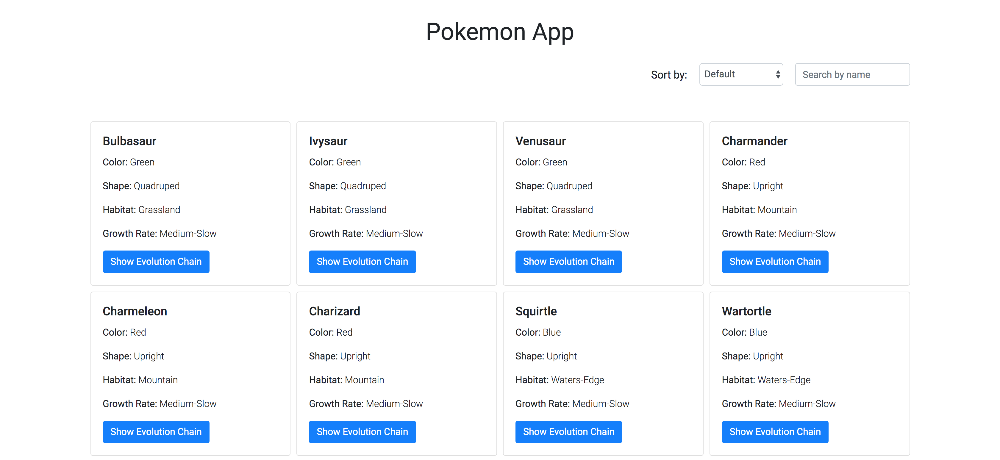
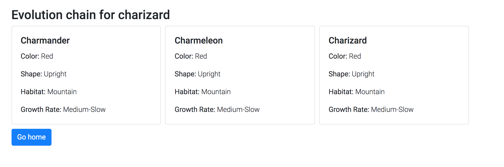

# Pokemon App

This application allows a user to see a list of pokemons and see all the pokemon species in the same _evolution chain_ of a clicked pokemon.

### Pokemon List view



### Pokemon evolution chain view




# Technology stack
1. ReactJS
2. Jest
3. Sass
4. Webpack

# Steps to install

- Clone this repository
```
git clone https://github.com/rotimi-babalola/pokeapi-app.git
```
- Install dependencies
```
npm install
```
- Start the application in development mode

```
npm run start:dev
```

- Run production build
```
npm run build:client-prod
```

Have fun!
